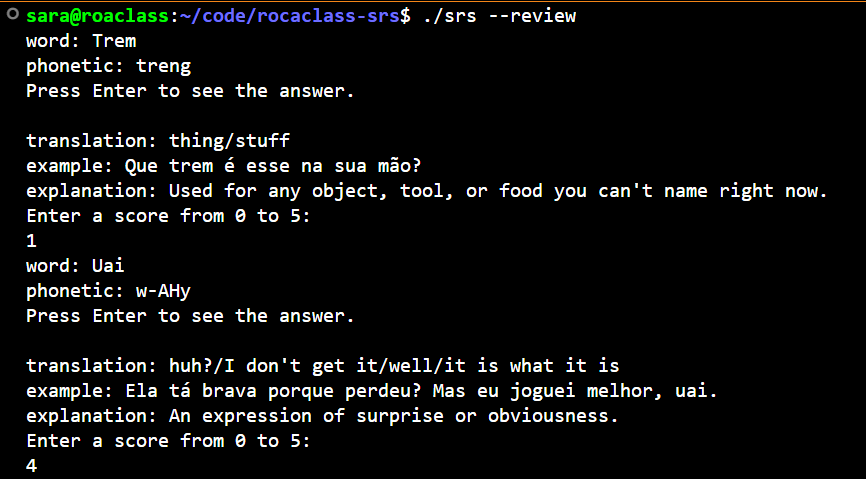

# Roça Class SRS

## Overview
Rocaclass SRS is a command‑line spaced repetition system written in C and backed by SQLite. 
It drills Brazilian Portuguese vocabulary with a focus on Mineiro phonetics and regional expressions. 
The core of the system is the SM‑2 algorithm (SuperMemo 2), which schedules reviews based on recall 
difficulty: cards remembered easily are shown less often, while difficult cards reappear sooner.


## SM-2 Algorithm

SM-2 (SuperMemo 2) is the scheduling algorithm used in Roça Class SRS. It determines when each card
should be reviewed based on how well you recall it. If you remember a card easily, the interval
before seeing it again grows longer. If you struggle, the card reappears sooner. This adaptive spacing
accelerates vocabulary acquisition by focusing practice where it is most needed.

**Interval calculation:**
```
I(1) = 1 day
I(2) = 6 days
I(n) = I(n-1) x EF [for n>2]
```

**Easiness factor update:**
```
EF_new = EF + (0.1 - (5 - q) x (0.08 + (5 - q) x 0.02))
```

Where `q` is the quality of recall (0-5) and `EF` starts at 2.5. If `q < 3`, the interval resets to 1.
EF never drops below 1.3.

## Data Structure

```c
typedef struct {
    int id;                         // unique card ID (SQLite primary key)
    char word[128];                 // the word or phrase in Portuguese
    char translation[256];          // English or Portuguese gloss
    char phonetic[128];             // Mineiro phonetic transcription
    char example[512];              // example sentence in context
    char explanation[512];          // brief explanation
    float easiness;                 // EF, starts at 2.5
    int interval;                   // days until next review
    int repetitions;                // number of successful reviews
    char next_review[11];           // ISO date: "YYYY-MM-DD"
} Card;
```

## Build

**Clone the repository:**
```bash
git clone https://github.com/sara-s-sena/rocaclass-srs.git
cd rocaclass-srs
```

**Dependencies:** GCC, make, libsqlite3-dev

On Ubuntu/Debian:
```bash
sudo apt install build-essential libsqlite3-dev
```

**Compile:**
```bash
make
```

**Run:**
```bash
./srs --list     # list all cards
./srs --add      # add a new card
./srs --review   # start a review session
```

## Seed Data

`data/seed.sql` contains 50 authentic Mineiro Portuguese expressions - regional vocabulary, phonetic 
approximations, and cultural context specific to Minas Gerais. To load them into the database:

```bash
./srs --list    # creates the database on first run
sqlite3 rocaclass.db < data/seed.sql
```

## Demo



## License

MIT License. See [LICENSE](LICENSE) for details.